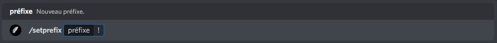

# Préfixe

## :satellite: Mise en place du préfixe

Pour débuter la configuration du préfixe de John-Bot, vous devez logiquement ajouter John-Bot à votre serveur pour ce faire consultez le **** [**guide d'ajout de John-Bot**](../#ajouter-john-bot-a-votre-serveur-discord), une fois cela fait, exécutez la commande `/setprefix` <mark style="color:blue;"></mark> ou encore `john setprefix` suivi du préfixe de votre choix dans l'encadré `préfixe` (commande slash) ou encore directement après la commande (commande avec préfixe).\
\
Pour mon exemple, je vais définir `!` comme nouveau préfixe pour John-Bot, je vais donc exécutez la commande `/setprefix` et indiquer dans l'encadré `préfixe`  `!` (voir image #1). Puis je vais exécuter la commande, suite à cette action John-Bot confirmera le changement de préfixe (voir image #2).

