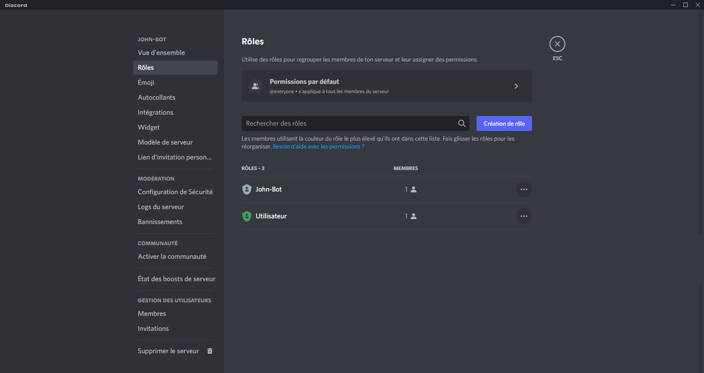

# Rôle d'arrivée


Cette page est actuellement en cours de refonte, suite à la mise à jour de l'AutoRole, il se peut que certaines informations soit erronées.


## :airplane\_small: Mise en place du système de rôle d'arrivée

Pour débuter la configuration du système d'arrivée, vous devez ajouter John-Bot à votre serveur pour ce faire consultez le **** [**guide d'ajout de John-Bot**](../#ajouter-john-bot-a-votre-serveur-discord), une fois cela fait exécutez la commande `/autorole add` ou encore `john autorole add` suivi d'un rôle d'arrivée dans l'encadré `rôle` (commande slash) ou encore directement après la commande (commande avec préfixe).\
\
Pour mon exemple, je vais ajouter `@Utilisateur` comme rôle d'arrivée, je vais donc exécutez la commande `/autorole add` et indiquer dans l'encadré `rôle`  `@Utilisateur` (voir image #1). Puis je vais exécuter la commande, suite à cette action John-Bot confirmera l'ajout du rôle d'arrivée à la liste des rôles d'arrivé (voir image #2).


Assurez-vous que rôle d'intégration de John-Bot soit en haut de votre rôle d'arrivée. (voir image #3)


## :eyes: Afficher la liste des rôles d'arrivée

Vous ne vous rappelez plus si vous avez activé le rôle d'arrivée ou encore quel rôle vous avez configuré ? Si c'est le cas vous n'avez qu'à exécuter la commande `/autorole view` ou encore `john autorole view` dans un salon textuel et le tour est joué ! (voir image #4)

<figure><figcaption>
Image #4
</figcaption></figure>

## :x: Désactivé le rôle d'arrivée

Le système de rôle d'arrivée ne vous convient plus ? Si c'est le cas vous en saurez plus sur comme le désactivation après lu ce court texte. Pour désactiver le système de rôle d'arrivée, vous n'avez qu'à exécuter la commande `/autorole disable` ou encore `john autorole disable` dans un salon textuel et le tour est joué ! (voir image #3)


Si le système de rôle d'arrivée ne vous convient plus, notre équipe se fera un plaisir de savoir pourquoi, afin de pouvoir l'améliorer !


