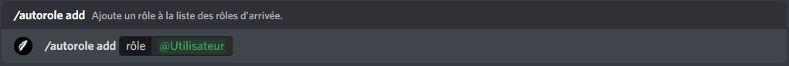
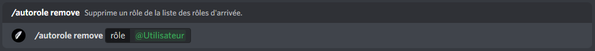

# Système de rôle d'arrivée

## :airplane\_small: Mise en place du système de rôle d'arrivée

Pour débuter la configuration du système d'arrivée, vous devez ajouter John-Bot à votre serveur pour ce faire consultez le **** [**guide d'ajout de John-Bot**](../#ajouter-john-bot-a-votre-serveur-discord), une fois cela fait exécutez la commande `/autorole status` et sélectionner "Activer" et le tour est joué ! (voir image #1)

## :busts\_in\_silhouette: Ajouter un rôle d'arrivée

Vous venez d'activer le système de rôle d'arrivée certes, mais maintenant pour qu'il soit réellement utile vous devez ajouter des rôles d'arrivée !\
\
Pour mon exemple, je vais ajouter le rôle `@Utilisateur` comme rôle d'arrivée, je vais donc exécutez la commande `/autorole add` et indiquer dans l'encadré `rôle`  "`@Utilisateur`" (voir image #2). Puis je vais exécuter la commande, suite à cette action John-Bot confirmera l'ajout du rôle d'arrivée à la liste des rôles d'arrivé (voir image #3).


Assurez-vous que rôle d'intégration de John-Bot soit en haut de votre rôle d'arrivée. (voir image #4)


<figure><figcaption>
Image #2
</figcaption></figure>

## :wastebasket: Supprimer un rôle d'arrivée

Vous souhaitez retirer un rôle de votre liste des rôles d'arrivée ? Si oui, rien de plus simple !\
\
Pour mon exemple, je vais supprimer le rôle `@Utilisateur` de mes rôles d'arrivée, je vais donc exécutez la commande `/autorole remove` et indiquer dans l'encadré `rôle`  "`@Utilisateur`" (voir image #5). Puis je vais exécuter la commande, suite à cette action John-Bot confirmera la suppression du rôle de ma liste des rôles d'arrivé (voir image #6).

<figure><figcaption>
Image #5
</figcaption></figure>

<figure><figcaption>
Image #6
</figcaption></figure>

## :eyes: Afficher la liste des rôles d'arrivée

Vous ne vous rappelez plus si vous avez activé le système de rôle d'arrivée ou encore quels rôles vous avez configurés ? Si c'est le cas vous n'avez qu'à exécuter la commande `/autorole list` ou encore `john autorole list` dans un salon textuel et le tour est joué ! (voir image #7)

<figure><figcaption>
Image #7
</figcaption></figure>

## :x: Désactiver le système de rôle d'arrivée

Le système de rôle d'arrivée ne vous convient plus ? Si c'est le cas, vous n'avez qu'à exécuter la commande `/autorole status` et sélectionner "Désactiver" ou encore `john autorole status`  et sélectionner "Désactiver" dans un salon textuel et le tour est joué ! (voir image #8)


Si le système de rôle d'arrivée ne vous convient plus, notre équipe se fera un plaisir de savoir pourquoi, afin de pouvoir l'améliorer !


