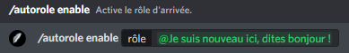

# Rôle d'arrivée

## :airplane\_small: Mise en place du rôle d'arrivée

Pour commencer, vous pouvez taper la commande `/autorole view` pour vous assurez de ne pas avoir activée le rôle d'arrivée (voir image #1).

Maintenant la partie de le configurer ! Suffit de taper `/autorole enable` à la suite de votre choix de rôle (voir image #2). Un message de succès est supposé d'apparaitre, si ce n'est pas le cas contacter l'équipe de John-Bot via notre adresse e-mail de contact [**team@johnbot.app**](mailto:team@johnbot.app) **** ou bien via notre serveur [**Discord**](https://discord.gg/abePbS7QKY)**.**


Assurez-vous que le rôle John-Bot soit en haut de votre rôle d'arrivée.


## :radioactive: Désactivé le rôle d'arrivée

Envie de désactiver le rôle d'arrivée ? Tapez la commande `/autorole disable` et le tour est joué (voir image #3) !

