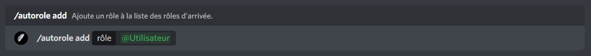

# Rôle d'arrivée

## :airplane\_small: Mise en place du rôle d'arrivée

Pour débuter la configuration du système d'arrivée, vous devez ajouter John-Bot à votre serveur pour ce faire consultez le **** [**guide d'ajout de John-Bot**](../#ajouter-john-bot-a-votre-serveur-discord), une fois cela fait exécutez la commande `/autorole enable` ou encore `john autorole enable` suivi de votre rôle d'arrivée dans l'encadré `rôle` (commande slash) ou encore directement après la commande (commande avec préfixe).\
\
Pour mon exemple, je vais définir `@Utilisateur` comme nouveau rôle d'arrivée, je vais donc exécutez la commande `/autorole enable` et indiquer dans l'encadré `rôle`  `@Utilisateur` (voir image #1). Puis je vais exécuter la commande, suite à cette action John-Bot confirmera l'activation du rôle d'arrivée sur le rôle choisie (voir image #2).


Assurez-vous que rôle d'intégration de John-Bot soit en haut de votre rôle d'arrivée. (voir image #3)


## :eyes: Afficher le rôle d'arrivée actuel

## :x: Désactivé le rôle d'arrivée

Envie de désactiver le rôle d'arrivée ? Tapez la commande `/autorole disable` et le tour est joué (voir image #3) !

