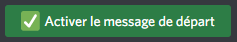
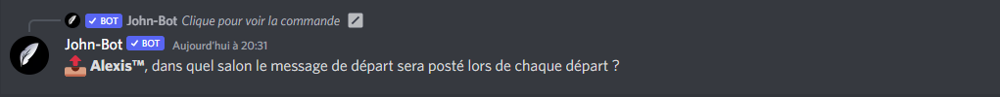
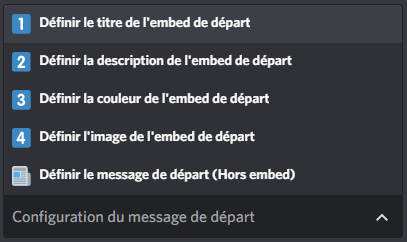
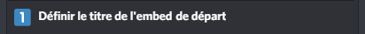
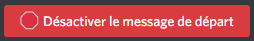
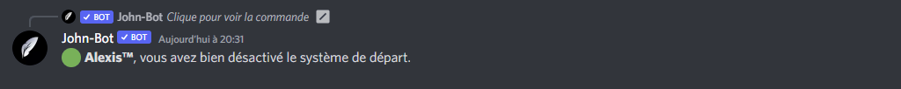

# Système de départ

## :wave: Mise en place du système de départ

Pour débuter la configuration du système de départ, vous devez ajouter John-Bot à votre serveur pour ce faire consultez le **** [**guide d'ajout de John-Bot**](../#ajouter-john-bot-a-votre-serveur-discord), une fois cela fait exécutez la commande `/leavepanel` <mark style="color:blue;"></mark> ou encore `john leavepanel` dans un salon textuel afin d'avoir accès au panel de configuration du système de départ.\
\
Pour ce qui de l'activation du système de départ, vous n'avez qu'à cliquer sur le bouton "Activer le message de départ" (voir image #1) une fois le bouton enclenché, vous devez indiquer le salon qui recevra les messages d'arrivée (voir image #2). Voilà ! Le système de départ est activé sur votre serveur ! &#x20;


Assurez-vous que John-Bot ait la permission d'envoyer le message de départ dans le salon configuré.


## :art: Configuration du message de départ

C'est super d'activer le système d'arrivée, mais entre nous, le message de base n'est pas bien beau. C'est là qu'entre en jeu la configuration du message de départ ! Si ce n'est pas déjà fait, vous devez exécuter la commande `/leavepanel` <mark style="color:blue;"></mark> ou encore `john leavepanel` dans un salon textuel afin d'avoir accès au panel de configuration du système de départ. \
\
Une fois la commande exécutée, vous devez vous servir du menu (voir image #3) de cette dernière afin de configurer votre message de départ à votre guise.\
\
Pour configurer un élément de votre message de départ, vous devez sélectionner l'option (voir image #4) que vous souhaitez configurer à votre manière.\
\
Pour mon exemple, je vais personnaliser le titre de mon embed de départ, je vais donc sélectionner la première option (voir image #5) une fois l'option sélectionnée, je vais devoir indiquer mon propre titre qui donc, remplacera celui de base (voir image #6). \
\
La manipulation indiqué l'exemple ci-dessus, reste la même pour toutes les autres options de configuration de votre message de départ.


Lors la configuration de votre message de départ est très fortement recommandé de consulté le [**guide des variables**](../autres/variables.md).


## :x: Désactivation du système de départ

Le système de départ ne vous convient plus, et vous vous demandez comment le désactiver ? Si c'est le cas vous en saurez plus après avoir lu ce rapide texte. Si ce n'est pas déjà fait, vous devez exécuter la commande `/leavepanel` ou encore `john leavepanel` dans un salon textuel afin d'avoir accès au panel de configuration du système de départ. \
\
Une fois le panel de configuration sous la main, vous n'avez qu'à cliquer sur le bouton "Désactiver le message de départ" (voir image #7) une fois le bouton enclenché, John-Bot confirmera la désactivation du système de départ (voir image #8).


Si le système de départ ne vous convient plus, notre équipe se fera un plaisir de savoir pourquoi, afin de pouvoir l'améliorer !


