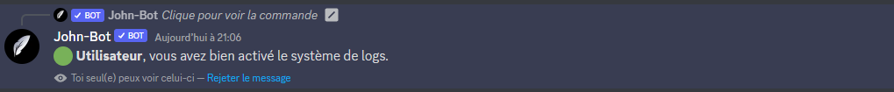
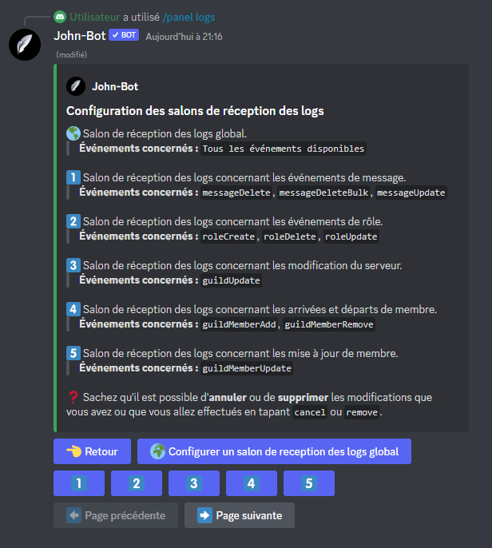
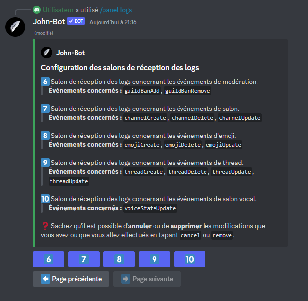
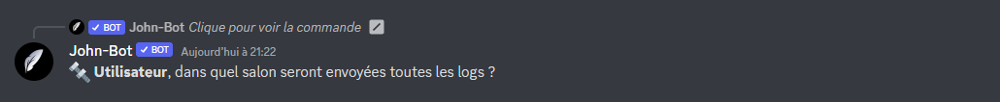

# Système de logs


La page du système de logs est actuellement en cours de création, cela prend du temps ! Si vous avez une question sur le système de logs venez la poser sur le [**serveur support de John-Bot**](https://discord.com/invite/abePbS7QKY) !&#x20;


## :airplane\_small: Activation du système de logs

Pour débuter la configuration du système de logs, vous devez ajouter John-Bot à votre serveur pour ce faire consultez le **** [**guide d'ajout de John-Bot**](../#ajouter-john-bot-a-votre-serveur-discord), une fois cela fait exécutez la commande `/panel logs` dans un salon textuel afin d'avoir accès au panel de configuration du système de logs.\
\
Pour ce qui de l'activation du système de logs, vous n'avez qu'à cliquer sur le bouton "Activer le système de logs" (voir image #1) une fois le bouton enclenché, un message de confirmation sera envoyé. Voilà ! Le système de logs est activé sur votre serveur !

<figure><figcaption>
Image #1
</figcaption></figure>

<figure><figcaption>
Image #2
</figcaption></figure>

## :white\_check\_mark: Configuration des salons de réceptions des logs

Une fois le système de logs activé, vous devez configurer les differents salons de réception des logs. Si ce n'est pas déjà fait, exécutez la commande `/panel logs` dans un salon textuel afin d'avoir accès au panel de configuration du système de logs.\
\
Une fois le panel de configuration sous vos yeux, cliquez sur le bouton "Configuration des différents salons de réception des logs" (voir image #3) une fois le bouton enclenché, une page s'ouvre affichant les 11 (6 sur la page #1 et les autres sur la page #2) salons différents pouvant accueillir les différents groupes d'événements (voir image #4 et #4.2).\
\
Dans mon exemple, je vais configurer un salon de réception global. Je vais donc, pour commencer, par sélectionner le bouton "Configurer un salon de réception des logs global"  (voir image #5) un fois cela fait, je vais indiquer le salon qui réceptionnera toutes les logs du serveur (voir image #6). La confugration est la même pour les 10 autres salons pouvant être configurés.

<figure><figcaption>
Image #3
</figcaption></figure>

<figure><figcaption>
Image #4
</figcaption></figure>

<figure><figcaption>
Image #4.2
</figcaption></figure>

<figure><figcaption>
Image #5
</figcaption></figure>

<figure><figcaption>
Image #6
</figcaption></figure>


Assurez-vous que John-Bot ait la permission d'envoyer les messages de logs dans le salon configuré.


## :star: Ajouter des événements

## :wastebasket: Supprimer des événements

## :bar\_chart: Voir le statut des événements

## :mute: Ajouter des salons ignorés

## :sound: Supprimer des salons ignorés

## :page\_facing\_up: Voir la liste des salons ignorés

## :x: Désactiver le système de logs
