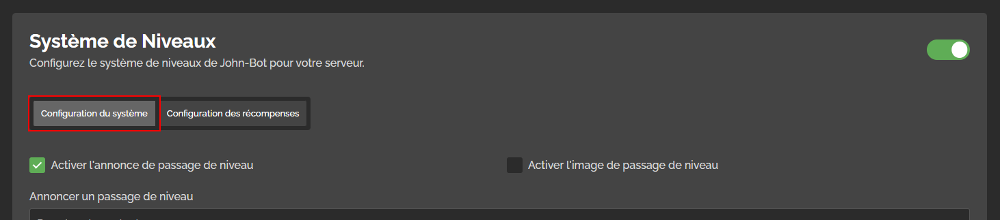
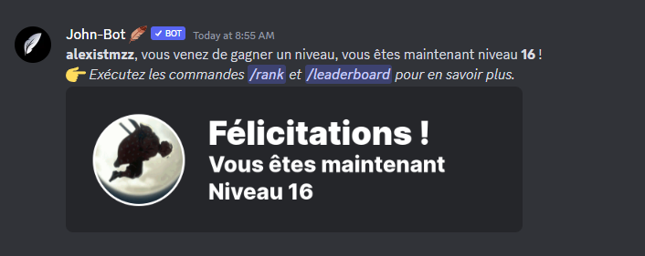

# Système de Niveaux

## :rocket: Introduction


Pour accéder au tableau de bord, il va de soit de vous y connecter avec votre compte Discord.


Avant de configurer le système de niveaux pour votre serveur, vous devez, avant tout, vous rendre sur le tableau de bord de votre serveur. Pour ce faire, exécutez la commande /dashboard dans un salon textuel, puis cliquez sur le bouton "Tableau de Bord" en dessous de l'embed. Une fois cela fait, rendez-vous dans la catégorie "Niveaux" du tableau de bord.


Avant de commencer la configuration du système de Niveaux, pensez à l'activer à l'aide du "Slider" à droite du module.


## :gear: Configuration du système

### C'est quoi ?

La configuration du système, c'est la partie du module ou vous pourrez configurer le système de Niveaux. Pour savoir qu'est-ce que la partie "Configuration des récompenses", référez vous à [cette partie](systeme-de-niveaux.md#introduction) de l'article.

### Commencer la configuration

Pour débuter la configuration du système, rendez-vous dans la partie "Configuration du système" du module.

<figure><figcaption>
Sélection de la partie "Configuration du système" du module
</figcaption></figure>

Une fois dans cette partie, vous allez pouvoir débuter la configuration du système.&#x20;

### L'annonce de passage de niveau

L'annonce de passage de niveau, c'est le message qui sera envoyé lorsqu'un membre passe d'un niveau à un autre. Vous pouvez voir un exemple d'annonce ci-dessous. ⬇️

<figure><figcaption>
Exemple d'annonce de passage de niveau
</figcaption></figure>
