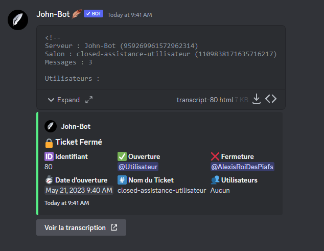
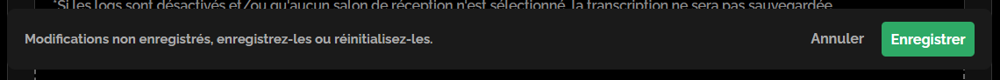
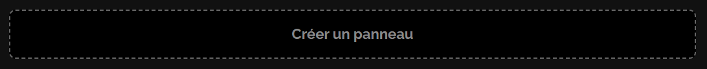
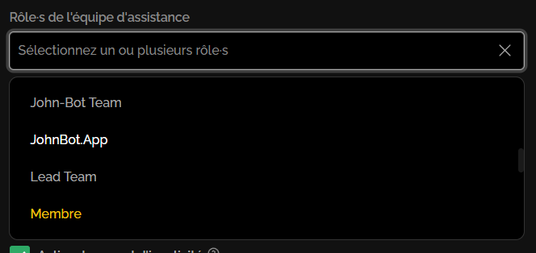

# Système de ticket


La page du système de ticket est actuellement en cours de création, cela prend du temps ! Si vous avez une question sur le système de ticket venez la poser sur le [**serveur support de John-Bot**](https://discord.com/invite/abePbS7QKY) !


## :earth\_americas: Configuration Globale

### Logs

Les logs du système de tickets sont très utiles, elles permettent, lorsqu'un ticket est fermé d'avoir quelques informations sur ce dernier (voir image #1). Afin d'activer les logs, rien de plus simple il vous suffit de cocher la case "Activer/Désactiver les logs" (voir image #2) puis d'indiquer un salon d'envoie des logs (voir image #3) puis, sauvegarder via la notification de modifications (voir image #4)

<figure><figcaption>
image #1
</figcaption></figure>

<figure><figcaption>
Image #2
</figcaption></figure>

<figure><figcaption>
Image #3
</figcaption></figure>

<figure><figcaption>
Image #4
</figcaption></figure>

### Limite de Tickets

La limite de tickets du système de tickets définie combien de tickets peuvent être ouvert en simultané par un membre. Afin de configurer cette limite, il vous suffit simplement de choisir une option parmi le menu de sélection de la limite de tickets (voir image #5), puis, sauvegarder.

<figure><figcaption>
Image #5
</figcaption></figure>

### Transcriptions


Si les logs et/ou qu'aucun salon de logs n'est défini, les transcriptions seront désactivées


Les transcriptions de tickets peuvent s'avérer très pratique, afin des les activer, il vous suffit de cocher la case "Activer/Désactiver les transcriptions" (voir image #6) puis sauvegarder.

<figure><figcaption>
Image #6
</figcaption></figure>

## :jigsaw: Créer un panneau

Afin de créer un panneau, il vous suffit d'appuyez sur la case "Créer un panneau" (voir image #7).

<figure><figcaption>
Image #7
</figcaption></figure>

### Configurer un nom pour le panneau


Si vous souhaitez avoir des panneaux triés dans un ordre bien précis, indiquez A, B, C etc.. devant les noms de panneau afin qu'ils soient triés selon votre ordre sur l'embed.


Afin de configurer un nom pour le panneau, rendez vous dans la case "Nom du panneau" puis indiquez un nom.

<figure><figcaption>
Image #8
</figcaption></figure>

### Configurer un ou plusieurs rôles d'assistance

Pour configurer un ou plusieurs rôles d'assistance (max. 5), rendez vous dans la case "Rôle·s de l'équipe d'assistance" puis cliquez sur le menu de sélection et sélectionnez tous les rôles de l'équipe d'assistance souhaité (voir image #9).

<figure><figcaption>
Image #9
</figcaption></figure>

### Configurer un ou plusieurs rôles à mentionner&#x20;

Afin de configurer un ou plusieurs rôles à mentionner lors de la création du ticket (max. 3), rendez vous dans la case "Rôle·s à mentionner lors de l'ouverture" puis effectuer les mêmes étapes que dans la partie [**Configurer un ou plusieurs rôles d'assistance**](systeme-de-ticket.md#configurer-un-ou-plusieurs-roles-dassistance).

## :earth\_americas: Modifier un panneau

## :earth\_americas: Supprimer un panneau

## :earth\_americas: Créer un embed

## :earth\_americas: Modifier un embed

## :earth\_americas: Supprimer un embed

## :earth\_americas: Créer un modèle

## :earth\_americas: Modifier un modèle

## :earth\_americas: Supprimer un modèle

## :toolbox: Commandes du système de tickets 

Les commandes du système de tickets sont un moyen alternatif à la gestion des tickets.

### :busts\_in\_silhouette: Add

La commande Add permet d'ajouter un membre au ticket (voir image #x).

Syntaxe de la commande : /add \<Membre>
