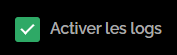
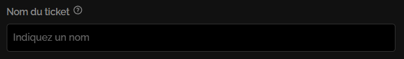
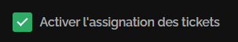
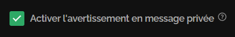
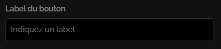
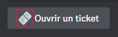
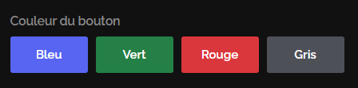
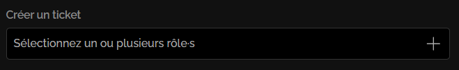

# Système de tickets


La page du système de tickets est actuellement en cours de création, cela prend du temps ! Si vous avez une question sur le système de ticket venez la poser sur le [**serveur support de John-Bot**](https://discord.com/invite/abePbS7QKY) !


## :earth\_americas: Configuration Globale

### Logs

Les logs du système de tickets sont très utiles, elles permettent, lorsqu'un ticket est fermé d'avoir quelques informations sur ce dernier (voir image #1). Afin d'activer les logs, rien de plus simple il vous suffit de cocher la case "Activer/Désactiver les logs" (voir image #2) puis d'indiquer un salon d'envoie des logs (voir image #3) puis, sauvegarder via la notification de modifications (voir image #4)

<figure><figcaption>
image #1
</figcaption></figure>

<figure><figcaption>
Image #2
</figcaption></figure>

<figure><figcaption>
Image #3
</figcaption></figure>

<figure><figcaption>
Image #4
</figcaption></figure>

### Limite de Tickets

La limite de tickets du système de tickets définie combien de tickets peuvent être ouvert en simultané par un membre. Afin de configurer cette limite, il vous suffit simplement de choisir une option parmi le menu de sélection de la limite de tickets (voir image #5), puis, sauvegarder.

<figure><figcaption>
Image #5
</figcaption></figure>

### Transcriptions


Si les logs et/ou qu'aucun salon de logs n'est défini, les transcriptions seront désactivées.


Les transcriptions de tickets peuvent s'avérer très pratique, afin des les activer, il vous suffit de cocher la case "Activer/Désactiver les transcriptions" (voir image #6) puis sauvegarder.

<figure><figcaption>
Image #6
</figcaption></figure>

## :jigsaw: Créer un panneau

Afin de créer un panneau, il vous suffit d'appuyez sur la case "Créer un panneau" (voir image #7).

<figure><figcaption>
Image #7
</figcaption></figure>

### Options du panneau

#### Configurer un nom pour le panneau


Si vous souhaitez avoir des panneaux triés dans un ordre bien précis, indiquez A, B, C etc.. devant les noms de panneau afin qu'ils soient triés selon votre ordre sur l'embed.


Afin de configurer un nom pour le panneau, rendez vous dans la champ de texte "Nom du panneau" puis indiquez un nom.

<figure><figcaption>
Image #8
</figcaption></figure>

#### Configurer un ou plusieurs rôles d'assistance

Pour configurer un ou plusieurs rôles d'assistance (max. 5), rendez vous dans la case "Rôle·s de l'équipe d'assistance" puis cliquez sur le menu de sélection et sélectionnez tous les rôles de l'équipe d'assistance souhaités (voir image #9).

<figure><figcaption>
Image #9
</figcaption></figure>

#### Configurer un ou plusieurs rôles à mentionner&#x20;

Afin de configurer un ou plusieurs rôles à mentionner lors de la création du ticket (max. 3), rendez vous dans la case "Rôle·s à mentionner lors de l'ouverture" puis effectuer les mêmes étapes que dans la partie [**Configurer un ou plusieurs rôles d'assistance**](systeme-de-tickets.md#configurer-un-ou-plusieurs-roles-dassistance).

#### Configurer une catégorie de création

Pour configurer une catégorie de création des tickets rendez vous dans la case "Catégorie de création des tickets" puis cliquez sur le menu de sélection et sélectionnez la catégorie souhaitée (voir image #10).&#x20;

<figure><figcaption>
Image #10
</figcaption></figure>

#### Configurer le nom du ticket

Afin de définir un nom pour le ticket lors de sa création, rendez vous dans la champ de texte "Nom du ticket"  puis indiquez le nom du ticket (voir image #11). De plus, lors de la configuration du nom du ticket, il est conseiller de se référer au [**guide des variables**](../autres/variables.md) afin d'utiliser les variables lors de votre configuration.

<figure><figcaption>
Image #11
</figcaption></figure>

#### Configurer un modèle lié au panneau

Pour définir un modèle lié au panneau, vous devez d'abord créer un modèle, pour ce faire référez vous au [**guide de création d'un modèle**](systeme-de-tickets.md#creer-un-modele). Une fois votre modèle mis en place, vous n'avez qu'à cliquer sur le menu de sélection et sélectionner le modèle souhaité (voir image #12).&#x20;

<figure><figcaption>
Image #12
</figcaption></figure>

#### Activer l'assignation des tickets

Afin d'activer l'assignation "claim" des tickets, vous n'avez qu'à cocher la case "Activer l'assignation des tickets Activer le rappel d'inactivité" (voir image #13).

<figure><figcaption>
Image #13
</figcaption></figure>

#### Activer le rappel d'inactivité

Le rappel d'inactivité envoie un message dans un ticket qui n'a pas reçu de nouveau message depuis une semaine ou plus. Ce rappel n'est envoyé qu'une fois par ticket et a pour but de rappeler la présence d'un ticket tombé aux oubliettes (voir image #14). Afin d'activer ce rappel, vous n'avez qu'à cocher la case "Activer le rappel d'inactivité" (voir image #15)

<figure><figcaption>
Image #14
</figcaption></figure>

<figure><figcaption>
Image #15
</figcaption></figure>

#### Activer l'avertissement en message privé

L'avertissement en message privé envoie un message privé au membre ayant créé le ticket, ce message contient quelques informations sur le ticket (voir image #16). Afin d'activer ce rappel, vous n'avez qu'à cocher la case "Activer l'avertissement en message privé" (voir image #17)

<figure><figcaption>
Image #16
</figcaption></figure>

<figure><figcaption>
Image #17
</figcaption></figure>

#### Activer la gestion du ticket exclusive

Si la gestion du ticket exclusive est activée, lorsqu'un ticket est assigné à un membre de l'équipe d'assistance, il sera impossible pour les autres membres de l'équipe d'écrire dans le ticket, afin de ne pas nuire à la compréhension du ticket. Pour activer la gestion du ticket exclusive, vous n'avez qu'à cocher la case "Activer la gestion du ticket exclusive" (voir image #18)

<figure><figcaption>
Image #18
</figcaption></figure>

### Bouton du panneau

#### Configurer le label du bouton

Le label du bouton, c'est le texte affiché sur ce dernier (voir image #19). Afin de configurer ce court texte, rendez dans le champ de texte "Label du bouton" (voir image #20) puis indiquez le label souhaitez.

<figure><figcaption>
Image #19
</figcaption></figure>

<figure><figcaption>
Image #20
</figcaption></figure>

#### Configurer l'émoji du bouton


Pour utiliser un émoji personnalisé, vous n'avez qu'à indiquer l'identifiant de cet émoji dans le champ de texte.


L'émoji du bouton, c'est l'émoji affiché au côté du texte (voir image #21). Pour le configurer, rendez dans le champ de texte "Émoji du bouton" (voir image #22) puis indiquez l'émoji souhaitez, pour s'y faire vous pouvez vous aider du sélecteur d'émoji (voir image #23).

<figure><figcaption>
Image #21
</figcaption></figure>

<figure><figcaption>
Image #22
</figcaption></figure>

<figure><figcaption>
Image #23
</figcaption></figure>

#### Couleur du bouton

Afin de définir la couleur du bouton, rendez vous dans la section "Couleur du bouton" (voir image #24) puis cliquez sur la couleur souhaitez.

<figure><figcaption>
Image #24
</figcaption></figure>

### Permissions du panneau

#### Liste des permissions :

* **Créer un ticket**\
  Permission de créer un ticket. Par défaut : Tout le monde.
* **Réclamer le ticket**\
  Permission de réclamer "claim" le ticket. Par défaut : Membres ayant les rôles de l'équipe d'assistance.&#x20;
* **(Re)Ouvrir le ticket**\
  Permission de (re)ouvrir le ticket fermé. Par défaut : Tout le monde.&#x20;
* **Fermer le ticket**\
  Permission de fermer le ticket. Par défaut : Tout le monde.&#x20;
* **Supprimer le ticket**\
  Permission de supprimer le ticket. Par défaut : Membres ayant les rôles de l'équipe d'assistance.&#x20;

#### Configurer les rôles des permissions

Afin de configurer les permissions, rendez vous dans la section "Permissions du panneau" (voir image #25) puis dans le menu de sélection de la permission souhaité (voir image #26) et sélectionnez tous les rôles souhaités (max. 3)

<figure><figcaption>
Image #25
</figcaption></figure>

<figure><figcaption>
Image #26
</figcaption></figure>

#### Réinitialiser les permissions

Si vous souhaitez revoir vos permissions et ne pas perdre de temps à désélectionner tous les rôles un par un, vous n'avez qu'à cliquer sur le bouton "Réinitialiser toutes les permissions" (voir image #27).

<figure><figcaption>
Image #27
</figcaption></figure>

## :earth\_americas: Modifier un panneau

## :earth\_americas: Supprimer un panneau

## :earth\_americas: Créer un embed

## :earth\_americas: Modifier un embed

## :earth\_americas: Supprimer un embed

## :earth\_americas: Créer un modèle

## :earth\_americas: Modifier un modèle

## :earth\_americas: Supprimer un modèle

## :toolbox: Commandes du système de tickets 

Les commandes du système de tickets sont un moyen alternatif à la gestion des tickets.

### :busts\_in\_silhouette: Add

La commande Add permet d'ajouter un membre au ticket (voir image #x).

Syntaxe de la commande : /add \<Membre>
