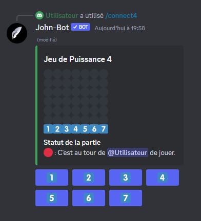

# Connect4

La commande Connect4 permet lorsqu'elle est exécuté correctement de lancer une partie du jeu puissance 4 avec un utilisateur (voir image #1). La commande Connect4 est aussi utilisable en slash commande.

Syntaxe de la commande : /connect4 \<utilisateur>
