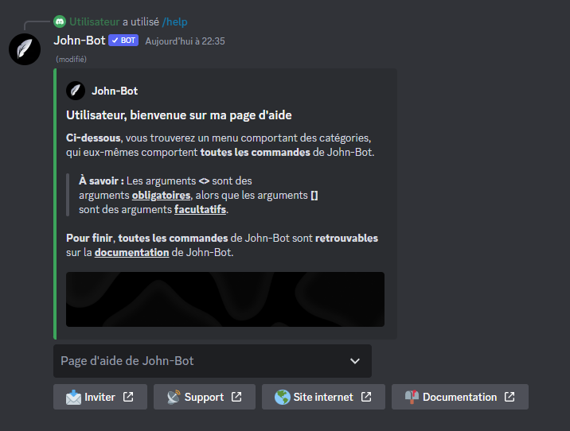

# Help

La commande permet d'afficher toutes les commandes de John-Bot ; page d'aide et liens utiles (voir image #1). La commande Help est aussi utilisable en slash commande.

Syntaxe de la commande : \<Préfixe ou />help
