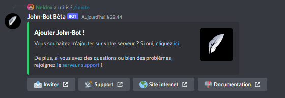

# Invite

La commande Invite vous permet d'obtenir un lien d'invitation pour ajouter John-Bot sur votre serveur, celle-ci montre aussi les liens utiles (voir image #1).

Syntaxe de la commande : \<Préfixe ou />invite
