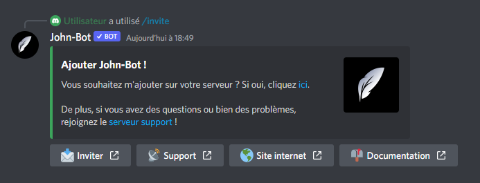

# Invite

La commande Invite permet d'afficher d'obtenir un lien d'invitation pour ajouter John-Bot à votre serveur en plus des liens utiles (voir image #1). La commande Invite est aussi utilisable en slash commande.&#x20;

Syntaxe de la commande : \<Préfixe ou />invite
