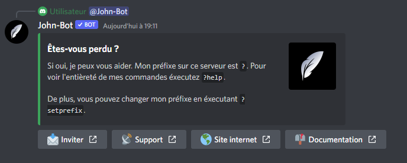

# Prefix

La commande Prefix permet d'afficher le préfixe de John-Bot sur le serveur où elle est exécutée en plus d'afficher les liens utiles (voir image #1).

Syntaxe de la commande : @John-Bot#7830 ou \<Préfixe>prefix
