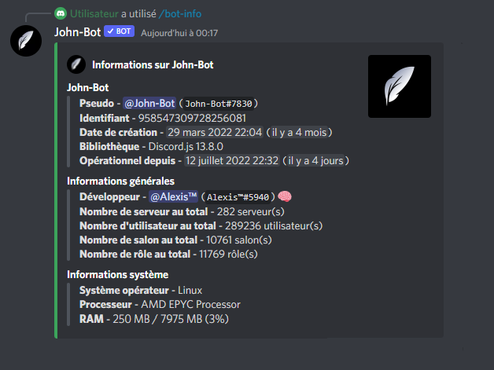

# Bot-info

La commande Bot-info permet d'afficher les informations de John-Bot. (voir image #1). La commande Bot-info est aussi utilisable en commande à préfixe.

Syntaxe de la commande : /bot-info
