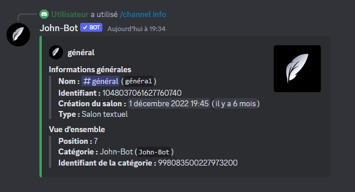

# Channel-info

La commande Channel-info permet d'afficher les informations d'un salon. (voir image #1). La commande Channel-info est aussi utilisable en slash commande.

Syntaxe de la commande : /channel-info \[# ou identifiant du salon]
