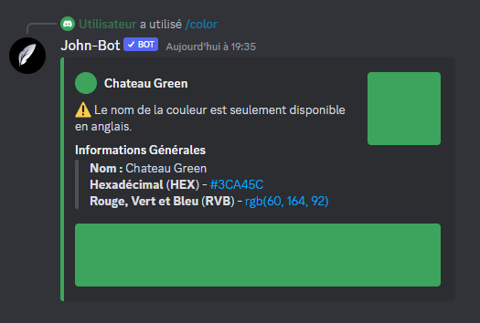

# Color

La commande Color permet lorsqu'elle est exécuté correctement d'afficher les informations à propos d'une couleur. (voir image #1). La commande Color est aussi utilisable en slash commande.

Syntaxe de la commande : /color \<couler en Hexadécimal>
