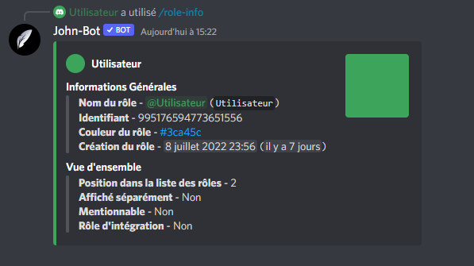

# Role-info

La commande Role-info permet d'afficher les informations à propos d'un rôle. (voir image #1). La commande Role-info est aussi utilisable en commande à préfixe.

Syntaxe de la commande : /role-info \[@ ou identifiant du rôle]
