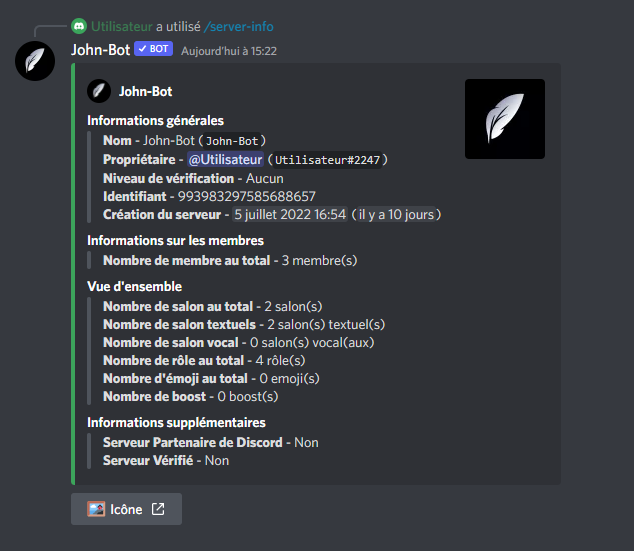

# Server-info

La commande Server-info permet d'afficher les informations du serveur ou elle est exécutée ou bien d'un serveur où John-Bot est présent. (voir image #1). La commande Server-info est aussi utilisable en slash commande.

Syntaxe de la commande : \<Préfixe ou />server-info \[identifiant du serveur]
