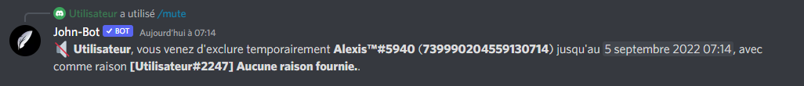

# Mute


Vous devez avoir la permission d'exclure temporairement des membres pour utiliser cette commande.


La commande Mute permet lorsqu'elle est exécutée correctement permet d'empêcher un utilisateur de parler pendant un certain temps. (voir image #1). La commande Mute est aussi utilisable en slash commande.

<figure><figcaption>
Image #1
</figcaption></figure>

Syntaxe de la commande : \<Préfixe ou />mute \<utilisateur> \<temps> \[raison]
