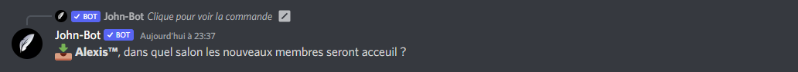
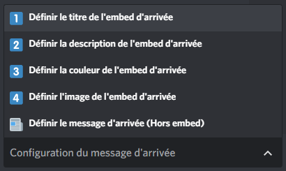
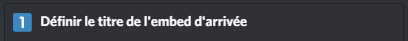
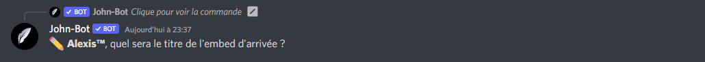

# Système d'arrivée

## :wave: Mise en place du système d'arrivée

Pour débuter la configuration du système d'arrivée, vous devrez ajouter John-Bot à votre serveur pour ce faire consultez le **** [**guide d'ajout de John-Bot**](../#ajouter-john-bot-a-votre-serveur-discord), un fois cela fait exécutez la commande `/joinpanel` <mark style="color:blue;"></mark> ou encore `john joinpanel` dans un salon textuel afin d'avoir accès au panel de configuration du système d'arrivée.\
\
Pour ce qui de l'activation du système d'arrivée, vous n'avez qu'à cliquer sur le bouton "Activer le message d'arrivée" (voir image #1) une fois le bouton enclenché, vous devrez indiquer le salon qui recevra les messages d'arrivée (voir image #2). Voilà ! Le système d'arrivée est activé sur votre serveur ! &#x20;


Assurez-vous que John-Bot ait la permission d'envoyer le message d'arrivée dans le salon configuré. Personnalisation du message d'arrivée


## :art: Configuration du message d'arrivée

C'est super d'activer le système d'arrivée, mais entre nous, le message de base n'est pas bien beau. C'est là qu'entre en jeu la configuration du message d'arrivée ! Si ce n'est pas déjà fait, vous devrez exécutez la commande `/joinpanel` <mark style="color:blue;"></mark> ou encore `john joinpanel` dans un salon textuel afin d'avoir accès au panel de configuration du système d'arrivée. \
\
Une fois la commande exécutée, vous devrez vous servir du menu (voir image #3) de cette dernière afin de configurer votre message d'arrivée à votre guise.\
\
Pour configurer un élément de votre message d'arrivée, vous devrez sélectionner l'option (voir image #4) que vous souhaitez configurer à votre manière.\
\
Pour mon exemple, je vais personnaliser le titre de mon embed d'arrivée, je vais donc sélectionner la première option (voir image #5) une fois l'option sélectionnée, je vais devoir indiquer mon propre titre qui donc, remplacera celui de base (voir image #6).&#x20;


La manipulation indiqué lors de mon exemple ci-dessus, reste la même pour toutes les autres options de configuration de votre message d'arrivée.



Lors la configuration de votre message d'arrivée est très fortement recommandé de consulté le [**guide des variables**](../autres/variables.md).


